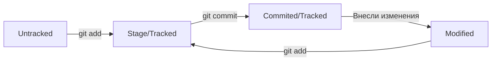

# **Автоматизация тестирования JAVA**

## **Вводная часть**

*Автоматизация тестирования* необходима для ускорения процесса тестирования, а так же уменьшения риска ошибок. Важно понимать, что не смотря на удобство автоматизации, ручное тестирование остаётся актуальным.

Процесс автоматизации тестирования вводится в конце SDLC после проведения ручного тестирования, когда продукт готов к выпуску в продакшн, а мы имеем готовые тест-кейсы для написания автотестов.

----
### **Почему JAVA?**

Язык программирования JAVA является одним из наиболее востребованных. Применяется для тестирования API, мобильных и веб-приложений. После изучения JAVA, не составит труда выучить любой другой язык программирования.

----
# **Начало работы с Git**

*Git* – система контроля версий, которая помогает отслеживать изменения в проекте. Используется как для индивидуальной, так и для командной работы.

*Git* позволяет сохранять изменения локально и при необходимости возвращаться к предыдущей версии проекта. Так же можно создавать удалённые репозитории на хостинг-платформе, которая работает с git, и поделиться результатом с другими.

*Git* является консольной программмой для работы с репозиториями, а GitHub - удалённый репозиторий для совместной работы над проектами.

----
### **Шифрование**

С помощью SSH-ключей (Secure Shell Protocol) мы можем безопасно отправлять данные в удалённый репозиторий и получать их с него.

Для шифрования используется пара ключей:

- *Приватный ключ* - хранится на компьютере и доступен только вам. Используется для расшифровки данных.

- *Публичный ключ* - доступен всем. Используется для шифрования данных.

Эти два ключа связаны и создают SSH-пару!

----
### **Хэш коммита**

Каждый коммит имеет уникальный *хэш*, в котором преобразована информация об авторе, дате, содержимом и ссылке на предыдущий коммит с помощью *SSH-ключа*.

Обычно *ХЭШ* - это строка состоящая из 40 символов: цифры от 0 до 9 и буквы A-F заглавные и строчные.

Для одного и того же коммита *ХЭШ* будет одинаковый. Но если изменить хоть один символ, то результат может сильно отличаться.

Все *ХЭШИ* и таблица соответствий хранится в служебных файлах, в папке .git.

----
### **Лог коммита**

После вызова команды `git log`, появится список коммитов.

Описание каждого коммита состоит из следующих элементов:

- Хэш коммита;
- Автор;
- Дата;
- Сообщение о коммите;

----
### **Файл HEAD**

Файл HEAD - один из служебных файлов папки .git. Он указывает на коммит, который был сделан последним. Внутри HEAD есть ссылка (путь) на служебный файл - *refs/heads/master*, которая содержит хэш последнего коммита. При каждом новом коммите git обновляет хэш в сыылке, соответственно обновляя и HEAD.

----
### **Статусы файлов в Git**

Одна из ключевых задач Git отслеживать изменения файлов в репозитории. Для этого каждый файл помечается различными статусами.

Рассмотрим их:

- *Untacked* - неотслеживаемый;
- *Stage* - добавлен в индекс, готов к коммиту.
- *Tracked* - отслеживаемый;
- *Modified* - изменённый;

----
### **Оформление сообщений к коммитам**

При вызове команды `git status --oneline`, консоль выводит на только первые 72 символа нашего сообщения.

Сообщение после коммита должно быть:

- Коротким;
- Ёмким;
- Информативным;
- В едином стиле;

То есть чётко описывать - что конкретно было сделано в этом коммите.

----
# **Основные команды Git**

**Команда** | **Пояснение**
--- | ---
`pwd` | Показать рабочую директорию
`cd` | Сменить директорию
`ls` | Отобразить содержимое директории
`ls -la .ssh/` | Посмотреть ssh-ключ
`touch` | Создать файл
`mkdir` | Создать директорию
`cp` | Копировать
`mv` | Пересместить
`cat` | Вывести содержимое файла
`rm` | Удалить
`rmdir` | Удалить директорию
`&&` | Позволяют записать несколько команд в одну строку
`↑↓` | Позволяют переключиться между прошлыми командами
`Tab` | Автозаполнение
`git init` | Инициализировать репозиторий
`rm -rf .git` | Разгитить папку
`git status` | Показывает текущее состояние репозитория
`git add` | Добавляет файлы в индекс
`git commit -m` | Сохраняет последние изменения
`git log` | Посмотреть историю комитов
`ssh-keygen -t` | Генерирует SSH-пару
`git romote add` | Привязывает удалённый репозиторий к локальному
`git remote -v` | Позволяет убедиться, что репозитории связанны
`git push` | Отправляет изменения на удалённый репозиторий